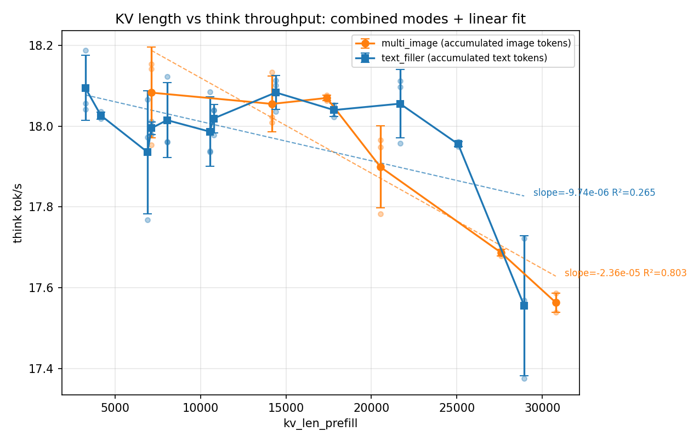
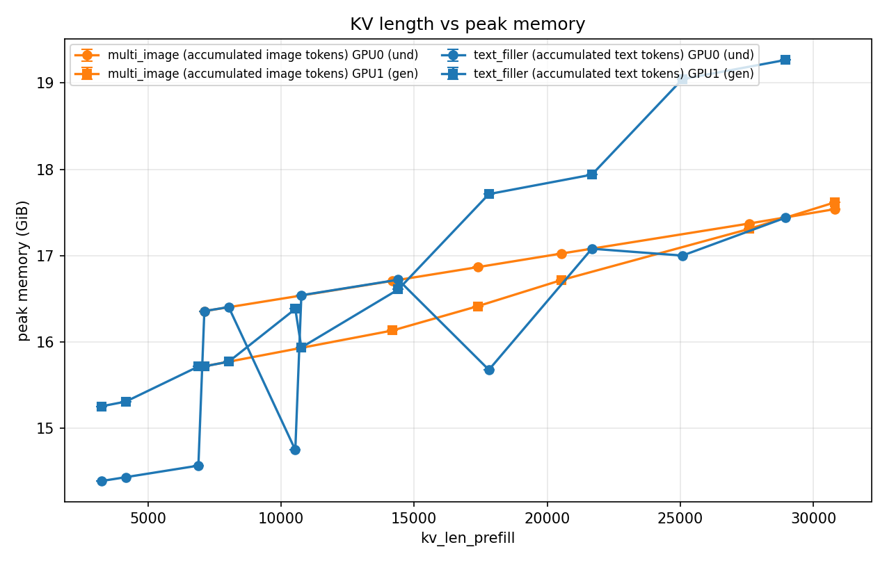

# KV cache 压缩收益验证

回应 compass 调研报告(`docs/reports/compass_artifact_wf-69e62e82-*.md`)给出的
"再评估阈值"(累积图片 token >8k、多轮 KV >20k 时应重新考虑 KV 压缩)。用两组
受控实验把 KV 长度(3254 → 30794,业务真实上限的 ~4-9 倍)直接扫穿这些阈值,
分别测量它对 **think 自回归 decode** 和 **image 去噪** 两条路径的真实影响:

```
think_tok/s(kv_len)  ≈ 常数 ≈ 17.5~18.2          (与 kv_len 基本无关,端到端变化 <5%)
t_image(kv_len)      ≈ t_image(0) + b · kv_len   (与图片分辨率独立可加,b·Δkv_len 达 35%~43%)
```

**TL;DR**:think 路径 KV 压缩**没有收益**,决策已经很清楚——KV 长度涨 4~8 倍,
think 吞吐几乎不动,拟合出的"趋势"多数只是噪声(R² 低至 0.07)。但 image 路径
**测出了一个此前被低估的真实成本**:固定生成分辨率不变、只加纯文本
filler,`t_image` 依然随 KV 长度强线性增长(R²>0.93),这**推翻了
`EDIT_THINK_RATIO.md` §3.2**"t_image 跟 kv_len 几乎无关"的旧结论(那是 2 点
混淆对比得出的)。所以结论不是"KV 压缩全无用",而是"对 think decode 没用,
但 image 路径的长上下文代价是真的,值得单独立项"。

---

## 1. 机器环境

| 项 | 配置 |
|---|---|
| GPU | 2× RTX 4090 24GB |
| 部署 | pipeline(13/15 accelerate 层间切分),与 `EDIT_THINK_RATIO.md` 同口径,结果可直接横向比较 |
| CFG | bench 预设(`cfg_text_scale=cfg_img_scale=1.0`),跳过 CFG 分支,每步 1 次前向 |
| think | budget forcing,cap=1000(`min=max=cap`),强制解码到定长以获得干净的 tok/s |
| 去噪步数 N | 10 |
| 重复 | 每个扫描点 3 次,共 54 trial,全部成功(`ok=True`) |

## 2. 局限

- **`NaiveCache` 非增量实现的混淆**:框架每次前向都重新分配整个 K/V 张量、把
  旧值写回去,不是标准的仅追加式 cache。本次测到的"think 平坦 / image 线性
  增长"可能部分反映这个框架级、与 KV 长度成正比的重建开销,而不是纯粹的
  attention 计算量——这也是判断"image 路径更可能是实现问题而非算法问题"的
  依据,但没有做单独 ablation(手写一个真正 append-only 的 cache 对照)来精确
  拆分两者占比。
- **单一硬件配置**:只在 2×4090 pipeline 放置下跑过,没覆盖阶段0的非对称
  放置或单卡场景;函数形式(think 平坦 / image 线性)大概率能迁移,具体斜率、
  截距不能直接外推。
- **think"无收益"的判断基于 <5% 的工程经验阈值**,不是统计显著性检验;如果
  未来场景把 KV 长度推到远超本次 30794 上限的量级(比如 10 万+ token),
  需要重新验证线性外推是否依然成立。
- 参考图池(women/octupusy/meme)在 `n_prior_turns>3` 时开始循环复用,不是
  5 张互不相同的新图;filler/前置轮文本语义与最终编辑指令无关——两点都不
  影响"KV 长度是否敏感"这个问题本身,但意味着没有测试更极端的多样化长上下文。

## 3. 实验设计

### 3.1 背景动机:为什么不是一个实验就够

`EDIT_THINK_RATIO.md` 的证据是观察性的——women.jpg(kv_len=7121)和
octupusy.jpg(kv_len=3254)除了 KV 长度不同,图像内容、输出分辨率、prompt
也全都不同,KV 长度这一个变量没有被单独隔离出来。最初只设计了"纯文本填充"
一种扫描,但业务真实的多轮编辑场景里,KV 暴涨靠的通常是新增参考图而不是
新增文本,先做了一版 token 构成拆解确认这一点:

| 场景 | 总 kv_len | VAE token | ViT token | 图片 token 合计占比 | 文本占比 |
|---|---|---|---|---|---|
| women 1024×800 | 7121 | 3200(44.9%) | 3850(54.1%) | **99.0%** | 1.0% |
| octupusy 688×512 | 3254 | 1376(42.3%) | 1813(55.7%) | **98.0%** | 2.0% |

编辑+think 场景下 KV 里 98%~99% 是图片 token(每张输入图同时产生 VAE 分支
和 ViT 分支两份 token),文本(system prompt + 一条编辑指令)只占 1%~2%。
单一的纯文本填充实验测出的曲线不能代表业务真实的 KV 增长方式,因此拆成两个
互补实验:**实验 A** 用真实图片累积复现业务场景,**实验 B** 用纯文本填充把
"KV 长度"和"内容类型(图片 token vs 文本 token)"这两个变量解耦,只有两组
结论方向一致,才能支持"通用 KV 压缩方法(不区分 token 类型,只按位置/
attention score 操作,如 LOOK-M / SnapKV)在此场景无收益"这个更强的论断。

### 3.2 实验 A:多图/多轮累积(18 trial)

复现"先看几轮参考图,再对最终图做一次编辑+think"的多轮对话场景:

| 项 | 值 |
|---|---|
| 独立变量 | `n_prior_turns` ∈ {0,1,2,3,4,5},即最终编辑之前先注入几轮"参考图+短指令" |
| 前置图片池 | `women.jpg` / `octupusy.jpg` / `meme.jpg` 循环取用(`n_prior_turns>3` 时开始复用),第 i 轮固定取池中第 `i mod 3` 张 |
| 前置轮次文本 | 每轮图片后追加一句固定短指令"For reference, please keep this in mind."(语义上是占位符,不影响 KV 长度这个自变量的定义) |
| 最终编辑图/prompt | 固定为 `women.jpg` + "She boards a modern subway, quietly reading a folded newspaper, wearing the same clothes."(与 `EDIT_THINK_RATIO.md` 的 trial 1 相同,可直接对比 n=0 这一点) |
| 每点重复 | 3 次,`seed = SEED_BASE + n_prior_turns×100 + repeat`,repeat 之间只有种子不同,其余条件严格一致 |
| 计时切分 | `t_prior_context`(前置 N 轮图文的一次性前向)/ `t_final_prefill`(最终图+文本)/ `t_think` / `t_image`,四段分别计时,`kv_len_prefill` 取自 `t_final_prefill` 结束后、`t_think` 开始前的真实 KV 长度 |

`n_prior_turns=0` 这一点与 `EDIT_THINK_RATIO.md` 里的 women.jpg trial 条件
完全相同,可作为两份数据之间的一致性锚点(§4/§5 的结果表已确认吻合)。

以 `n_prior_turns=5` 为例,实际拼进 KV 的输入序列长这样(图片池循环到第 4、5
轮时复用了 women/octupusy):

```
[system] "You should first think about the planning process in the mind and
          then generate the image. The planning process is enclosed within
          <think> </think> tags, ..."
[turn 1] <image: women.jpg>    + "For reference, please keep this in mind."
[turn 2] <image: octupusy.jpg> + "For reference, please keep this in mind."
[turn 3] <image: meme.jpg>     + "For reference, please keep this in mind."
[turn 4] <image: women.jpg>    + "For reference, please keep this in mind."   ← 池循环复用
[turn 5] <image: octupusy.jpg> + "For reference, please keep this in mind."   ← 池循环复用
[最终]   <image: women.jpg>    + "She boards a modern subway, quietly reading
                                   a folded newspaper, wearing the same clothes."
                                → gen_text(<think>...</think>) → gen_image(...)
```

`n_prior_turns=0` 时序列只剩 `[system] + [最终]` 两段,就是 `EDIT_THINK_RATIO.md`
里的原始 trial。

### 3.3 实验 B:纯文本填充(36 trial)

在两个不同的图片/分辨率基线上,各自独立地在编辑文本之后追加纯文本填充,
除 KV 长度外其余条件(尤其是**最终生成的图片分辨率**)全程不变:

| 项 | 值 |
|---|---|
| 独立变量 | `filler_token_n` ∈ {0, 1000, 4000, 8000, 16000, 24000} |
| 图片基线 1 | `women.jpg`(1024×800)+ "She boards a modern subway, quietly reading a folded newspaper, wearing the same clothes." |
| 图片基线 2 | `octupusy.jpg`(688×512)+ "Could you display the sculpture that takes after this design?" |
| 填充文本构造 | 固定中性句"The quick brown fox jumps over the lazy dog. "重复拼接,用 tokenizer 编码后精确截断到目标 token 数(而非按字符估算),保证 `filler_token_n` 与 KV 长度的实际增量严格对应 |
| 每点重复 | 3 次,`seed = SEED_BASE + 图片基线序号×10000 + filler档位序号×100 + repeat`,两个图片基线、6 个填充档位、3 次重复完全交叉,共 2×6×3=36 trial |
| 计时切分 | `t_prefill`(system prompt + 图 + 编辑文本 + 填充文本,一次性前向)/ `t_think` / `t_image` |

两个图片基线的 `filler_token_n=0` 分别对应 women.jpg(kv_len=7121)和
octupusy.jpg(kv_len=3254),与实验 A 的 `n_prior_turns=0` 及
`EDIT_THINK_RATIO.md` 的原始测量三方吻合,确认三份数据在起点上是可比的。

以图片基线 1(women.jpg)、`filler_token_n=8000` 为例,实际拼进 KV 的输入
序列长这样:

```
[system] "You should first think about the planning process in the mind and
          then generate the image. The planning process is enclosed within
          <think> </think> tags, ..."
[image]  <image: women.jpg>
[prompt] "She boards a modern subway, quietly reading a folded newspaper,
          wearing the same clothes."
[filler] "The quick brown fox jumps over the lazy dog. The quick brown fox
          jumps over the lazy dog. The quick brown fox jumps over the lazy
          dog. ..."   ← 固定句重复拼接, tokenizer 编码后精确截断到 8000 token
                       → gen_text(<think>...</think>) → gen_image(...)
```

`filler_token_n=0` 时序列只剩 `[system]+[image]+[prompt]`,即实验 A 的
`n_prior_turns=0`、也是 `EDIT_THINK_RATIO.md` 的原始 trial。图片基线 2
(octupusy.jpg)结构完全相同,只是 `[image]` 换成 octupusy.jpg、`[prompt]`
换成 "Could you display the sculpture that takes after this design?"。

### 3.4 共同参数与 warmup

两个实验共用 §1 表格里的 CFG/cap/N 配置,加载方式、计时口径(`sync_timer`
包裹 `torch.cuda.synchronize()`)与显存埋点(每卡 `reset_peak_memory_stats` +
`max_memory_allocated`)完全一致。正式采集前各跑一次 `cap=64` 的 warmup
trial(独立 seed,结果不计入数据),用于摊掉首次 CUDA kernel 编译/shape 缓存
的一次性开销,避免污染扫描区间里的第一个数据点。

## 4. think 路径:KV 长度不影响 decode 吞吐

| 数据来源 | KV 长度范围 | think tok/s 范围 | 线性拟合端到端变化 | R² |
|---|---|---|---|---|
| 实验 A | 7121 → 30794(4.3×) | 17.56 → 18.15 | -3.07% | 0.80 |
| 实验 B · women.jpg | 7121 → 28944(4.1×) | 17.38 → 18.12 | -1.96% | 0.43 |
| 实验 B · octupusy.jpg | 3254 → 25077(7.7×) | 17.77 → 18.19 | -0.33% | 0.07 |

三组独立数据方向一致:KV 长度涨 4~8 倍,think 吞吐变化幅度全部 <5%,且大部分
组 R² 很低——KV 长度基本解释不了 tok/s 的方差,那点微小趋势是噪声不是规律。
SnapKV / H2O / StreamingLLM 这类方法瞄准的正是 decode 阶段的这个瓶颈,在本
场景它不存在。



两组数据叠在一张图上,拟合线几乎水平,散点在误差棒范围内交织,看不出系统性
趋势。

## 5. image 路径:KV 长度独立于分辨率产生真实开销

| 数据来源 | KV 长度范围 | t_image 范围 | 线性拟合端到端变化 | R² |
|---|---|---|---|---|
| 实验 A(图片持续变大) | 7121 → 30794 | 4.58s → 6.48s | +41.2% | 0.996 |
| 实验 B · women.jpg(生成分辨率固定 1024×800) | 7121 → 28944 | 4.62s → 6.28s | +35.8% | 0.992 |
| 实验 B · octupusy.jpg(生成分辨率固定 688×512) | 3254 → 25077 | 2.19s → 3.13s | +43.2% | 0.938 |

关键在实验 B:两组里生成目标图片分辨率、VAE latent token 数从头到尾没变过,
唯一变化的是前面追加的纯文本 filler 长度,但 `t_image` 依然以 R²>0.93 的强
线性关系随 KV 长度增长。`EDIT_THINK_RATIO.md` §3.2 曾得出"t_image 跟
image_shape 强相关、跟 kv_len 几乎无关",但那只有 2 个数据点,图片分辨率和
KV 长度是同时变化的混淆变量;本次用纯文本填充把混淆剥离后,KV 长度本身对
`t_image` 有独立、可复现的贡献,该旧结论需要修正。



峰值显存也随 KV 长度线性增长,符合 KV cache 体量预期;测试范围内峰值 ≤19GiB,
24GB 卡仍有余量,当前不构成紧迫问题,增长曲线只是佐证 KV 长度效应真实存在。

## 6. 结论速查

| 路径 | 结论 | 下一步 |
|---|---|---|
| think(自回归 decode) | KV 压缩无收益(<5% 端到端变化,R² 低) | 停止评估这个方向,维持既有路线图优先级("投机解码 ≈ CUDA Graph > 视觉 token 剪枝 >> decode 期 KV 驱逐/量化")不变 |
| image(扩散去噪) | 长上下文有真实、可测量的代价(35%~43%,R²>0.93) | 不在现有阶段0/1/2 路线图内,值得单独立项;根因大概率是 cache 重建实现而非语义层面的驱逐/压缩算法,优先查实现修复方向 |

---

*原始数据:`experiments/outputs/kv_length_sweep_outputs/{multi_image,text_filler}_sweep_trials.csv`;脚本 `run_kv_length_sweep.py`,交互式版本
`kv_length_sweep_benchmark.ipynb`。*
